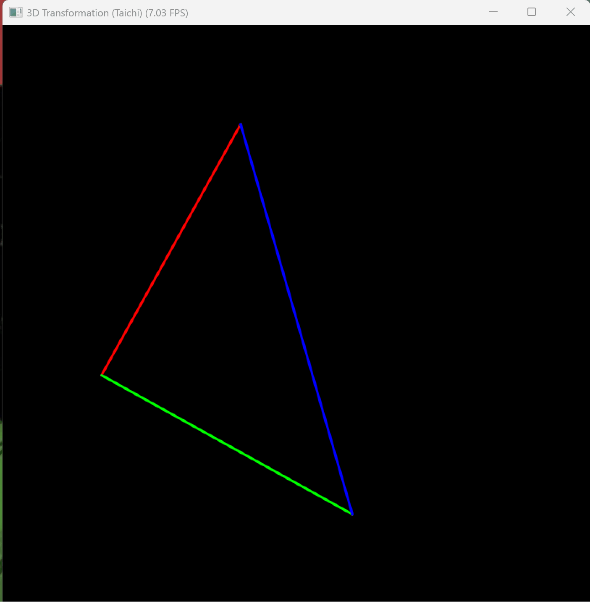
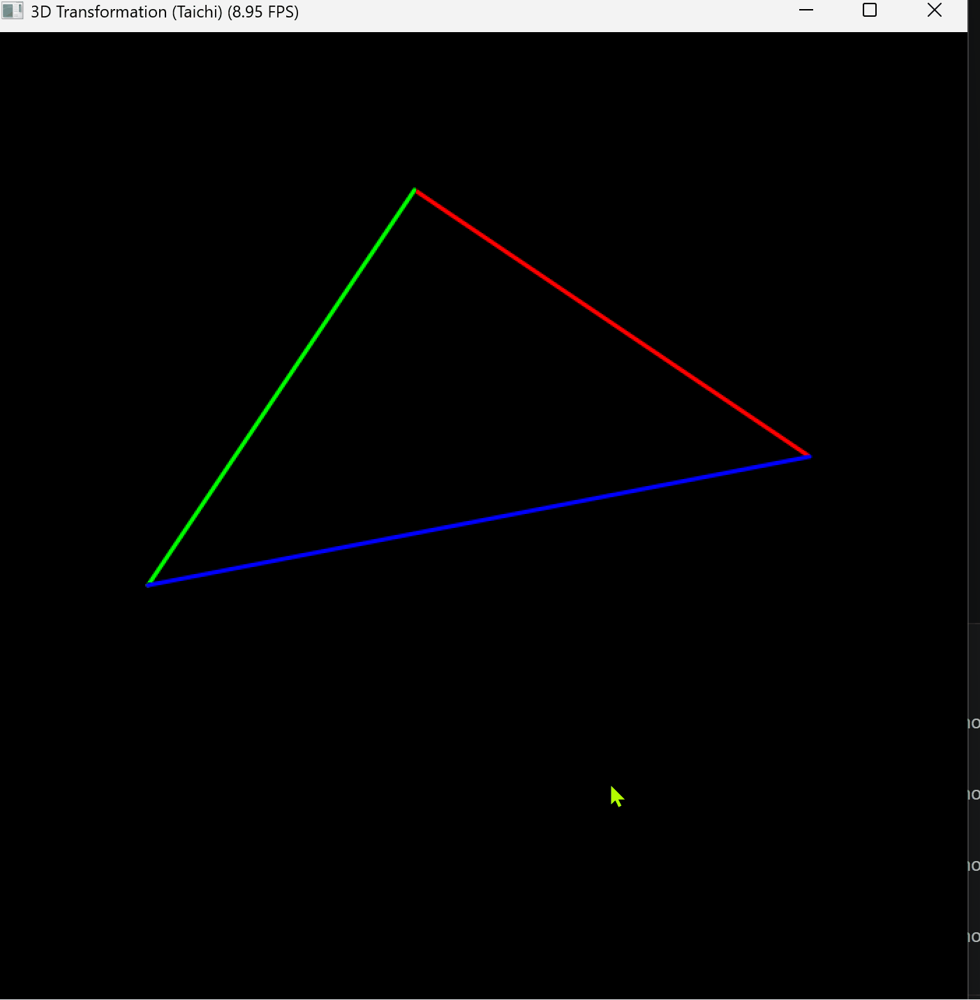

# 3D Transformation (Taichi)

## 📌 项目介绍

本项目基于 Taichi 实现了一个简单的 3D 图形变换与投影系统。

通过手动实现三维图形管线中的核心步骤：

* Model 变换（模型旋转）
* View 变换（摄像机变换）
* Projection 变换（透视投影）

最终将三角形从 3D 空间投影到 2D 屏幕，并进行可视化显示。

---

## 🎮 操作说明

* 按 `A`：逆时针旋转
* 按 `D`：顺时针旋转
* 按 `ESC`：退出程序

---

## 🖼️ 演示效果

<p align="center">
  
  
</p>

---

## 🛠️ 环境配置

```bash
conda create -n cg_env python=3.12 -y
conda activate cg_env
pip install taichi
```

---

## ▶️ 运行方法

```bash
python main.py
```

---

## 📐 实现原理

本项目核心基于经典的 3D 图形变换流程：

### 1️⃣ Model 变换

通过旋转矩阵对模型进行变换：

```
[ cosθ  -sinθ  0  0 ]
[ sinθ   cosθ  0  0 ]
[   0      0   1  0 ]
[   0      0   0  1 ]
```

---

### 2️⃣ View 变换

将摄像机移动到原点：

```
T = translation(-eye_pos)
```

---

### 3️⃣ Projection 变换

将 3D 空间投影到 2D 平面：

* 透视投影
* 齐次坐标归一化

---

### 4️⃣ MVP 变换

最终变换为：

```
MVP = Projection × View × Model
```

---

## 📚 技术要点

* 齐次坐标（Homogeneous Coordinates）
* 3D → 2D 投影
* 矩阵乘法
* Taichi GUI 渲染
* 键盘交互控制

---

## 📁 项目结构

```
.
├── main.py        # 主程序
├── demo1.gif      # 演示动画1
├── demo2.gif      # 演示动画2
├── README.md      # 项目说明
```

---

## ✨ 作者

Lan-jiang77